# Logistic Regression on MNIST

`Logistic regression`是一种概率性的分类器。它由权重矩阵$W$和偏置向量参数化$b$构成，通过将输入向量投影到一组超平面上来完成分类，每个超平面都对应一个类。从输入到超平面的距离反映了输入是相应类的成员的概率。

在数学上加入我们设输入向量为$x$，而表示$x$是$i$这一类的的概率为$Y$，那么我们可以得到如下的公式：
$$
\begin{aligned}
 P(Y=i|x, W,b) &= softmax_i(W x + b) \\
                &= \frac {e^{W_i x + b_i}} {\sum_j e^{W_j x + b_j}}
                \end{aligned}
$$

其中$W_i$表示的是$W$矩阵中的第$i$行，$b_i$同理。

### 算法推导：

因此我们的模型预测值就是取最大的$P$值时的类别$i$：
$$
y_{pred} = argmax_i P(Y=i|x,W,b)
$$
这个回归模型的本质就是$y=Wx+b$，然后求$W$和$b$的值。

在这个问题上我们使用交叉熵`softmax loss`来作为损失函数$\ell$:
$$
\begin{aligned}\ell (\theta=\{W,b\}, \mathcal{D})&=-\frac{1}{|\mathcal{D}|}\sum_{i=0}^{|\mathcal{D}|}
                \log(P(Y=y^{(i)}|x^{(i)}, W,b))y^{(i)}\\
                &=-\frac{1}{|\mathcal{D}|}\sum_{i=0}^{|\mathcal{D}|}log(softmax(Wx^{(i)}+b))y^{(i)}
                \end{aligned}
$$
其中，$y^{(i)}$代表数据集中第$i$个真实的输出值，$D$代表整个数据集，在这里我们取了平均值，来减小我们的计算量。$\theta$矩阵代表了$W$和$b$的集合，大小为$k \times (n+1)$。

为了获得我们回归模型里面的$W$和$b$值，我们需要引入损失函数，然后通过梯度下降法来逐步逼近损失函数最小时，我们的$W$和$b$的值。下面我们先对损失函数来进行讨论。

为方便起见，先设

$$
a=softmax(Wx+b)= \frac {e^{W x + b}} {\sum_j e^{W x + b}}
$$

那么我们的其中一个损失函数，即交叉熵函数可以表示为：
$$
\ell=-\sum_i y_iloga_i
$$

我们需要对损失函数进行求导，但是我们发现在实际情况中，我们只需要预测一个真实的结果，也就说我们真实值中是只有一个是$1$，而其余都是$0$的，这个时候我们可以假设$y^{(j)}=1$而其他的值均为$0$，此时我们的损失函数变成：
$$
\ell=-y_jloga_j
$$

而且我们还注意到这个唯一的非零元素还是1，因此式子可以再化简成：
$$
\ell=-loga_j
$$

这时我们再回来对损失函数进行求导，分两种情况：
$$
\begin{align}
\nabla_{\theta_j}\ell(\theta=\{W,b\},\mathcal D)=\frac{1}{|\mathcal{D}|}\times\left\{
\begin{array}{l}-\sum_{i=0}^{\vert\mathcal D\vert}\left[x^{(i)}\left(1-p(y^{(i)}=j\vert x^{(i)};\theta)\right)\right],\;&y^{(i)}=j\\
\sum_{i=0}^{\vert\mathcal D\vert}\left[x^{(i)}p(y^{(i)}=j\vert x^{(i)};\theta)\right],\;&y^{(i)}\neq j\end{array}\right.
\end{align}
$$
其中$\nabla_{\theta_j}\ell(\theta=\{W,b\},\mathcal D)$为损失函数对系数矩阵$\theta$的第$j$个向量的偏导数。

而在实际的应用之中我们发现仅仅使用该公式会出现多个最优解的情况，并不能很好的去得到我们的最大值。因此我们尝试通过添加一个权重衰减项$\frac{\lambda}{2} \sum_{i=1}^k \sum_{j=0}^{n} \theta_{ij}^2 $来修改我们的损失函数，这个衰减项会惩罚过大的参数值，然后我们的代价函数就变成：
$$
\ell (\theta=\{W,b\}, \mathcal{D})=-\frac{1}{|\mathcal{D}|}\sum_{i=0}^{|\mathcal{D}|}\log(P(Y=y^{(i)}|x^{(i)}, W,b))y^{(i)}+\frac{\lambda}{2} \sum_{i=1}^k \sum_{j=0}^{n} \theta_{ij}^2
$$
在加入这个权重衰减项之后我们的代价函数就变成了严格的**凸函数**，这样就能够保证得到唯一的解了，此时我们使用梯度下降之类的方法就能得到全局最优解。

此时我们的新导数也变成：
$$
\begin{align}
\nabla_{\theta_j}\ell(\theta=\{W,b\},\mathcal D)=\lambda \theta_j+ \frac{1}{|\mathcal{D}|}\times\left\{
\begin{array}{l}-\sum_{i=0}^{\vert\mathcal D\vert}\left[x^{(i)}\left(1-p(y^{(i)}=j\vert x^{(i)};\theta)\right)\right],\;&y^{(i)}=j\\
\sum_{i=0}^{\vert\mathcal D\vert}\left[x^{(i)}p(y^{(i)}=j\vert x^{(i)};\theta)\right],\;&y^{(i)}\neq j\end{array}\right.
\end{align}
$$

求出上面的偏导数公式之后，我们就能直接将它带入到**梯度下降法**中来实现最小化$\ell(\theta,\mathcal D)$。迭代的公式如下:
$$
\theta_j := \theta_j - \alpha \nabla_{\theta_j} \ell(\theta,\mathcal D)
$$
其中$\alpha$为每次迭代的步长。

### 数值实验：

#### **1、梯度下降法；**

朴素的**批量梯度下降法(BGD)**就是每次迭代更新每一个参数的时候都用到了所有的样本，在此处也就是每次迭代都用到了所有$60000$个训练样本。

此处使用梯度下降法来进行实验，在实验过程中我发现直接使用完整的梯度下降法每次迭代的计算量太大，导致迭代一次的时间需要非常久，突出了该算法的复杂度问题。

为了方便起见，在一开始我就使用了`Batch size`的概念来进行编程，当我把`Batch size`设置成数据集的大小的时候，就是完整的**批量梯度下降法**。

设置步长为$0.1$，$W$和$b$为随机生成的高斯分布，进行迭代，得到的结果如下：

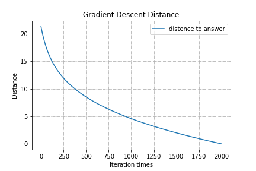
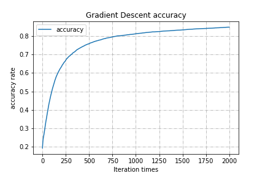

上面左图显示的是随着我们的迭代次数的增加，$W$的值与最优解的距离。

右图显示的是我们在测试集上的准确率随着迭代次数增加的变化曲线，在刚开始的时候我们准确率上升得非常快，但是越往后面迭代上升的速度就越慢，最后会趋于平缓。

两图综合来看，发现在随着迭代次数的上升，分类识别的**准确率**在一步步的上升，一直到趋近于极限值，而每次迭代计算结果与最优解距离也是在一步步地缩小，最后应该是会收敛成为一条直线。

最后收敛完成之后我们将矩阵$W$中对应那十个维度的$784$向量转换成$28\times28$的图像进行输出，结果如下:

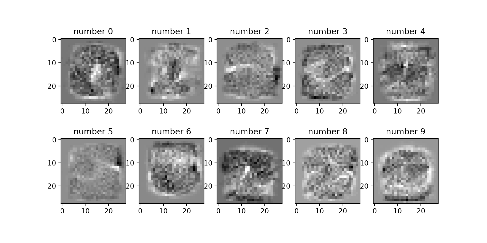

再上图可以比较清晰的看到其实每个矩阵都已经有了一点数字的轮廓了，尤其数字$0$，数字$1$，数字$3$特别明显，猜测在经过更多的训练之后数字的轮廓会更加明显，越加接近真实的数字形状。

#### **2、随机梯度法。**

随机梯度下降的具体思路是在更新每一参数时都只使用一个样本来进行更新，也就是每次只使用一张训练的兔粮来更新我们的参数，更新很多次。如果样本量很大的情况（例如几十万），那么可能只用其中几万条或者几千条的样本，就已经将theta迭代到最优解了，对比上面的批量梯度下降，迭代一次需要用到十几万训练样本，一次迭代不可能最优，如果迭代10次的话就需要遍历训练样本10次，这种更新方式计算复杂度太高。

但是因为随机也就是说我们用样本中的一个例子来近似我所有的样本，来调整*θ*，因而随机梯度下降是会带来一定的问题，因为计算得到的并不是准确的一个梯度，**对于最优化问题，凸问题，**虽然不是每次迭代得到的损失函数都向着全局最优方向， 但是大的整体的方向是向全局最优解的，最终的结果往往是在全局最优解附近。但是相比于批量梯度，这样的方法更快，更快收敛，虽然不是全局最优，但很多时候是我们可以接受的，所以随机梯度下降方法用的也比上面的多。

当我们梯度下降时的`batch_size`设置成1的时候，就是随机梯度下降法了，此时迭代公式不变，只是我们每次迭代都只使用其中的一个样本。

同样设置步长为$0.1$，$W$和$b$为随机生成的高斯分布，进行迭代，得到的结果如下：

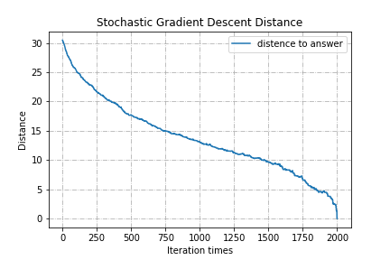
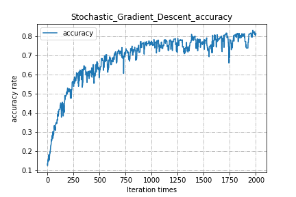

上面左图就是每次迭代之后到最优解的距离，而右图则是对应的准确率。右图中很明显的现象就是图像上下剧烈的抖动，识别的准确率忽高忽低，但是在迭代了很多次之后还是可以很明显的看出我们的模型正在逐步的向最优解方向收敛。值得注意的是我们在使用随机梯度的时候每次只用到了一个样本，因此单次迭代的时间远远小于原始的梯度下降法，所以尽管迭代的次数较多，但是收敛的速度还是非常快的，消耗的时间远远小于原始的梯度下降法。

### 结果分析

#### Mini Batch大小的影响：

##### **对计算精度函数的影响：**

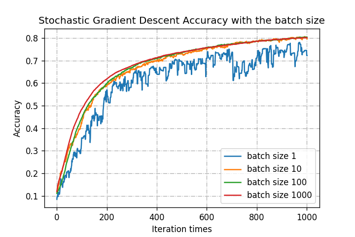

将步长固定在0.1的时候，我设置了不同的`batch size`之后将结果画在同一张图上进行对比。可以很清楚的看到随着`batch size`的增大， 我们的准确度曲线变得越来越光滑，抖动越来越小，但是总体的上升趋势变化不大。

##### 对于每步计算结果到最优解距离的影响：

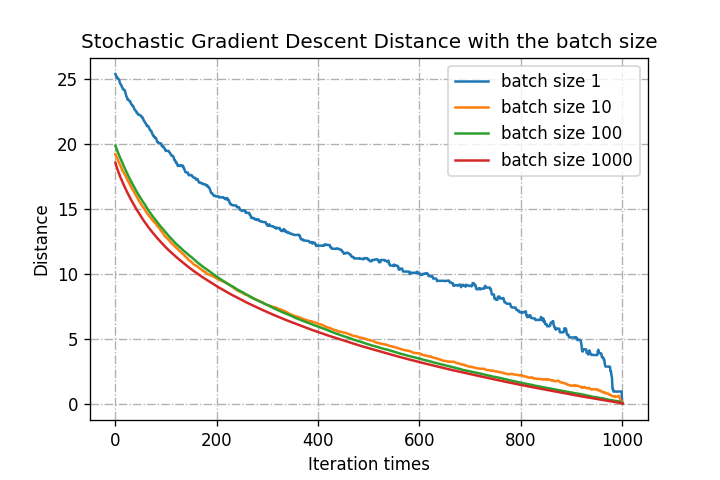

从图中可见当`batch size`为1的时候，图像有明显的波动，但是对于其他大小的`batch size`来说，曲线就较为光滑，而且下降趋势是前面较快而后面较慢，随机梯度法则一直都在抖动，总体还是在趋向于最优解。

#### 步长$\alpha$的影响：

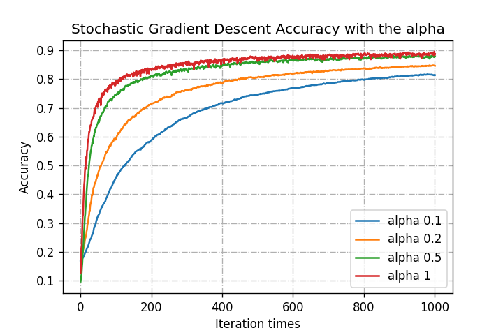

将`batch size`固定在100的时候，我设置了不同的步长值$\alpha$来观测其对迭代精度曲线的影响，并将结果画在同一张图上进行对比。从图中可以清楚的发现随着我们的步长的增大，一开始曲线上升得越快，但是在到达一定的阈值的时候，步长越大的曲线抖动得反而越加厉害，几乎没有办法保持直线，而步长较小的曲线则相对来说平稳了很多。说明步长在一开始能够加快我们的训练速度，但是确不容易保证稳定在最优解。

##### 对于每步计算结果到最优解距离的影响：

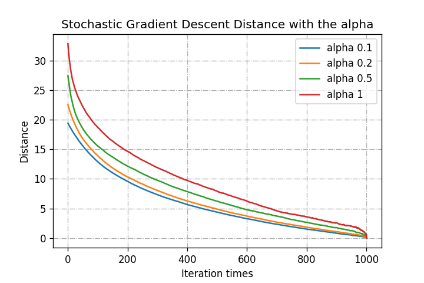

从图中趋势可以看出步长可以显著地提高每步计算与最终最优解的距离的速度。

#### 时间代价的影响：

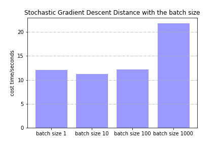
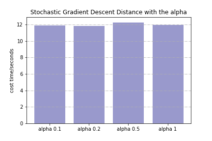

左上图列出了不同`batch size`对迭代1000次所耗费的时间大小进行比较，在其较小的时候几种不同大小的`batch`对于耗费时间的影响不大，几乎可以视为一致的。但是当`batch size`达到1000的时候就出现了较大的变化，训练的时间大大增加，再结合上面曲线的抖动情况来看，设置`batch size`为100的时候曲线较为平滑，且耗时较短，可以说是综合了**随机梯度下降**和**批梯度下降**的优点，在实际的机器学习训练中较为常用。

右上图展示了不同的步长$\alpha$对于迭代1000次次所耗费的时间大小 进行比较，从图中看出曲线的变化趋势不大，因此我们可以认为步长对于迭代时间的影响不大。

然而值得注意的是上一步的**批梯度下降算法**迭代2000次花费了2930.2309141159058秒的时间，要远远大于上面这几种方法，可见使用**小批量梯度下降**提升迭代的效率来说效果非常好。